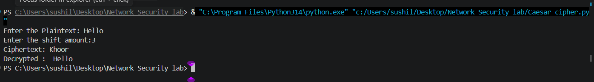

# Network Security Lab – Experiment 1

<p align="center">
  
  
  
</p>

A hands-on implementation of classical symmetric encryption techniques using Python. This experiment focuses on the Caesar cipher and the Vigenère cipher, comparing their working principles, strengths, weaknesses, and round-trip verification.

## Overview
This project demonstrates how two foundational classical ciphers work in practice:

- Caesar Cipher: uses a fixed shift value for all letters in a message
- Vigenère Cipher: uses a repeating key to apply varying shifts across the plaintext

The objective is to implement both ciphers, verify encryption and decryption logic, and analyze their security limitations in the context of modern cryptography.

## Project Structure

```text
Exp-1/
├── README.md
├── Code/
│   ├── Caesar_cipher.py
│   └── vignere.py
└── Outputs/
    ├── Caesar.png
    └── vignere.png
```

## Features
- Interactive user input for plaintext and key/shift values
- Encryption and decryption using modular arithmetic
- Preservation of spaces, numbers, and punctuation
- Verification of round-trip correctness using decryption comparison
- Visual output captured in the project folder

## 1. Caesar Cipher

The Caesar cipher shifts each alphabetic character by a fixed number of positions. It is one of the simplest encryption methods and is easy to implement, but it is easily broken because the key space is extremely small.

- File: [Code/Caesar_cipher.py](Code/Caesar_cipher.py)

### Example Output



### Working
1. User enters plaintext and shift value.
2. Each alphabetic character is shifted forward by the given amount.
3. Decryption reverses the same shift to recover the original text.

## 2. Vigenère Cipher

The Vigenère cipher improves on Caesar by using a repeating keyword, so different letters are shifted by different amounts. This makes it more resistant to simple frequency analysis than a fixed-shift cipher.

- File: [Code/vignere.py](Code/vignere.py)

### Example Output


### Working
1. User enters plaintext and keyword.
2. The key is repeated across the message.
3. Each letter is shifted according to its matching key letter.
4. Decryption uses the same key in reverse to restore the original text.

## Security Discussion

### Caesar Cipher
- Very easy to implement
- Small key space (only 25 possible shifts)
- Vulnerable to brute-force attack
- Vulnerable to frequency analysis

### Vigenère Cipher
- More secure than the Caesar cipher
- Uses multiple shifting values based on the key
- Reduces repeated patterns in ciphertext
- Still vulnerable if enough ciphertext is available and the key length is discovered

## Result
Both ciphers were successfully implemented and tested in Python. The decryption process matched the original plaintext in all validation cases, confirming the logic and correctness of the encryption schemes.

## Conclusion
This experiment provided valuable insight into classical symmetric ciphers, their mathematical foundations, and the practical limitations of older encryption methods. While both are historically important, they are not secure by modern standards and are primarily useful for educational understanding and cryptographic analysis.

## Author
Sushil

## License
This project is for academic and learning purposes.
